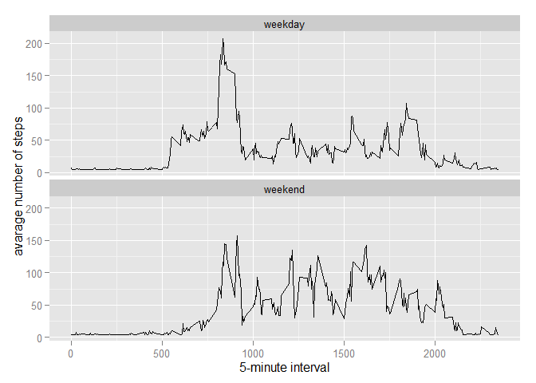

# Reproducible Research: Peer Assessment 1
Timothy A. Grove  
September 15, 2015  

## Load the required Packages and set working directory

#### 1. Packages required

```r
library(ggplot2)
library(Hmisc)
```

#### 2. Set local working directory.  This assumes the following:

* GitHub is located in default location on the local system
* The repository "RepData_PeerAssessment1" has been forked and replicated locally


```r
setwd("~/GitHub/RepData_PeerAssessment1")
```

## Loading and preprocessing the data
#### 1. Load the data (i.e. read.csv())

```r
activity <- read.csv('activity.csv')
```
#### 2. Process/transform the data (if necessary) into a format suitable for your analysis


----


## What is mean total number of steps taken per day?

NOTE: The missing values in the dataset can be ignored for these steps.

#### 1. Calculate the total number of steps taken per day

```r
stepsByDay <- tapply(activity$steps, activity$date, sum, na.rm=TRUE)
```

#### 2. Make a histogram of the total number of steps taken each day

```r
qplot(stepsByDay, xlab='Total steps per day', ylab='Frequency using binwith 500', binwidth=500)
```

 

#### 3. Calculate and report the mean and median total number of steps taken per day

```r
stepsByDayMean <- mean(stepsByDay)
stepsByDayMedian <- median(stepsByDay)
```

Steps taken per day:

* Mean: 9354.2295082
* Median:  10395

-----

## What is the average daily activity pattern?

In order to perform the follwing steps, create a data frame of the aggregated data


```r
averageDailySteps <- aggregate(x=list(meanSteps=activity$steps), by=list(interval=activity$interval), FUN=mean, na.rm=TRUE)
```

#### 1. Make a time series plot (i.e. type = "l") of the 5-minute interval (x-axis) and the average number of steps taken, averaged across all days (y-axis)


```r
ggplot(data=averageDailySteps, aes(x=interval, y=meanSteps)) +
    geom_line() +
    xlab("5-minute interval") +
    ylab("average number of steps taken") 
```

 

#### 2. Which 5-minute interval, on average across all the days in the dataset, contains the maximum number of steps?


```r
mostSteps <- which.max(averageDailySteps$meanSteps)
timeMostSteps <-  gsub("([0-9]{1,2})([0-9]{2})", "\\1:\\2", averageDailySteps[mostSteps,'interval'])
```

* Most Steps at: 8:35

----


## Imputing missing values

There are a number of days/intervals where there are missing values (coded as NA). The presence of missing days may introduce bias into some calculations or summaries of the data.

#### 1. Calculate and report the total number of missing values in the dataset (i.e. the total number of rows with NAs)


```r
numMissingValues <- length(which(is.na(activity$steps)))
```

* Number of missing values: 2304

#### 2. Devise a strategy for filling in all of the missing values in the dataset. The strategy does not need to be sophisticated. For example, you could use the mean/median for that day, or the mean for that 5-minute interval, etc.


```r
ImputedSet <- activity
ImputedSet$steps <- impute(activity$steps, fun=mean)
```

#### 3. Create a new dataset that is equal to the original dataset but with the missing data filled in.


```r
ImputedStepsByDay <- tapply(ImputedSet$steps, ImputedSet$date, sum)
qplot(ImputedStepsByDay, xlab='Total steps per day (Imputed)', ylab='Frequency using binwith 500', binwidth=500)
```

 

#### 4. Make a histogram of the total number of steps taken each day and Calculate and report the mean and median total number of steps taken per day. Do these values differ from the estimates from the first part of the assignment? What is the impact of imputing missing data on the estimates of the total daily number of steps?


```r
ImputedStepsByDayMean <- mean(ImputedStepsByDay)
ImputedStepsByDayMedian <- median(ImputedStepsByDay)
```
* Mean (Imputed): 1.0766189\times 10^{4}
* Median (Imputed):  1.0766189\times 10^{4}

----

## Are there differences in activity patterns between weekdays and weekends?

For this part the weekdays() function may be of some help here. Use the dataset with the filled-in missing values for this part.

#### 1.Create a new factor variable in the dataset with two levels - "weekday" and "weekend" indicating whether a given date is a weekday or weekend day.


```r
ImputedSet$dateType <-  ifelse(as.POSIXlt(ImputedSet$date)$wday %in% c(0,6), 'weekend', 'weekday')
```

#### 1.Make a panel plot containing a time series plot (i.e. type = "l") of the 5-minute interval (x-axis) and the average number of steps taken, averaged across all weekday days or weekend days (y-axis). See the README file in the GitHub repository to see an example of what this plot should look like using simulated data.


```r
ImputedSet <- aggregate(steps ~ interval + dateType, data=ImputedSet, mean)
ggplot(ImputedSet, aes(interval, steps)) + 
    geom_line() + 
    facet_grid(dateType ~ .) +
    xlab("5-minute interval") + 
    ylab("avarage number of steps")
```

 
